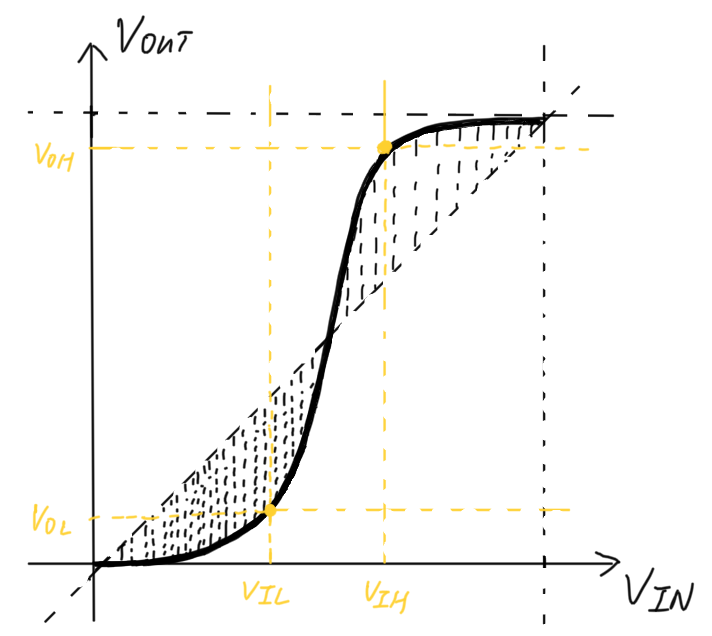
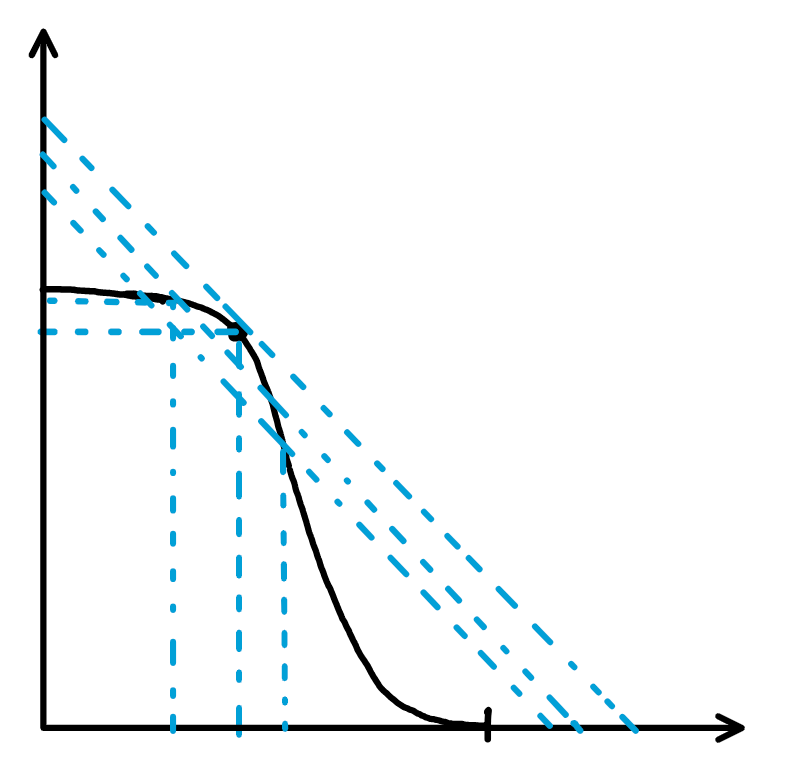
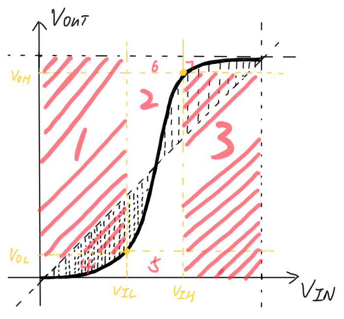

真实世界中，电路里面所有的电压值都是连续的。知道输入的电压以后，我们可以根据每一个门的电压的输入输出关系，知道每一个门的输出电压，最后得到整个电路的输出电压。电路中的电压可能是 5V 3.0V 2.8V 1.0V。

为了进入数字世界，我们在连续的电压值上增加一层抽象层，将连续的电压值映射为离散的 01，这层抽象层只存在于我们的脑子里，0 和 1 也是我们大脑对真实物理现象的一种理解和解读。这里说的映射和下面会提到的映射，实际上就是人脑进行的理解和解读。

在进入数字世界后，我们在观察电路时，就可以只关心电路的每个位置到底是 0 还是 1，而不用管每个位置的电压值到底是多少。

那么到底要如何进入数字世界？换句话说，人脑要用怎样的映射方式将连续的电压理解为 0 或 1？

## 映射方式

最简单的方法是将电压的范围 0 到 VDD，分成两部分。电压为 0 到 Vth 时，人理解为 0，电压为 Vth 到 VDD 时，人理解为 1。

但是这个方法有一个缺点。我们知道，真实电路中是存在噪音的。当电压值非常接近 Vth 时，一点轻微的噪音都会让电压值在 Vth 的附近来回波动。换句话说，如果一条导线上的电压值非常接近 Vth，人理解的值可能在 01 之间疯狂变化。这样显然是不行的。（存疑）

为了解决上述问题，我们设置两个 threshold。电压为 0 到 VL 时，人理解为 0，电压为 VH 到 VDD 时，人理解为 1。VL 到 VH 为 forbidden zone，这部分电压被理解为 0 还是 1，我们不关心。

这种情况下，一条导线上的 01 疯狂变化就不可能会出现了。但是，当电压值非常接近 VL 或者 VH 的时候，电压在人的理解中，会在 0、未知或者 1、未知之间疯狂变化。因为不会出现 0 变 1 或者 1 变 0，所以我们允许这种 0、未知之间或者 1、未知之间的变化存在。（存疑）

现在考虑两个 buffer，一个 buffer 的输出接另一个 buffer 的输入。上游 buffer 如果输出 VL-ε，然后因为噪音，下游 buffer 接收到 VL+ε。按照上面的理解方式，上游 buffer 在人的理解中输出 0，下游 buffer 在人的理解中接收到未知信号，这显然不是我们希望的。我们希望在我们眼里，下游 buffer 可以容忍噪音，接收到 0。

那么，我们需要对一个门的输入和输出设置不同的 VL VH。输出的 VH 大于输入的 VH，输出的 VL 小于输入的 VL。这样在存在一定噪音的情况下，一个门输出的 0 还可以在下一个门的输入被我们理解为 0，一个门输出的 1 还可以在下一个门的输入被我们理解为 1。

输出的 VL VH 为 VOL VOH，输入的 VL VH 为 VIL VIH。VOL VOH VIL VIH 被称为一个门的 logic level。

## 确定 Logic Level

现在，我们已经明确了如何根据一个门的 VOH VOL VIH VIL 将它的输入输出电压理解为 0 或 1。那么如何根据一个门的 DC Transfer Characteristic（即输入电压和输出电压之间的关系），确定它的 VOH VOL VIH VIL。

在确定 VOH VOL VIH VIL 时，有两个准则。我们希望两个 noise margin（即 VOH-VIH，VIL-VOL）尽可能大。同时这四个值需要满足 VOH > VIH > VIL > VOL。

### Buffer

我们先以 buffer 门为例子。

- 曲线上找

  首先，我们可以直接在 DC Transfer Characteristic 曲线上找这四个值，即 VIL 决定 VOL，VIH 决定 VOH，即在曲线上找两个点。

  需要说明的是，在曲线上确定这四个值肯定是没问题的。确定以后，当输入被理解为 0 时，输出肯定会被理解为 0；当输入被理解为 1 时，输出肯定会被理解为 1。valid in，valid out。

  先在曲线上找 VIL 和 VOL 对应的点。

  首先，因为 VIL > VOL，所以我们要在 VOUT=VIN 这条线下面的 VOUT=曲线 上找 VIL 和 VOL 对应的点。

  其次，因为我们需要最大化 VIL-VOL，即 noise margin，所以我们在图中把 noise margin 用竖线的方式表示出来，每一个 VIL 都有对应的 noise margin。我们的任务就是找出最大的 noise margin 对应的 VIL。在 VOUT 曲线上 VIL 对应的输出就是 VOL。

  我们只考虑 VOUT=VIN 和 VOUT=曲线 围起来的区域的前半部分，因为前半部分对应的 VOUT 曲线在 VOUT=VIN 下面。前半部分，通过简单的导数计算，可以发现当 VIL 的值使 VOUT 曲线斜率为 1 时，VIL-VOL 值最大，即 noise margin 最大。

  至于 VIL 和 VOL 本身的大小，倒不用考虑太多，一般来说 VIL VOL 稍微接近 0 就可以，不能太严苛。

  再在曲线上找 VIH 和 VOH 对应的点。

  首先，因为 VOH > VIH，所以我们要在 VOUT=VIN 这条线上面的 VOUT=曲线 上找 VIH 和 VOH 对应的点。

  其次，因为我们需要最大化 VOH-VIH，即 noise margin，所以我们在图中把 noise margin 用竖线的方式表示出来，每一个 VIH 都有对应的 noise margin。我们的任务就是找出最大的 noise margin 对应的 VIH。在 VOUT 曲线上 VIH 对应的输出就是 VOH。

  我们只考虑 VOUT=VIN 和 VOUT=曲线 围起来的区域的后半部分，因为后半部分对应的 VOUT 曲线在 VOUT=VIN 上面。后半部分，通过简单的导数计算，可以发现当 VIH 的值使 VOUT 曲线斜率为 1 时，VOH-VIH 值最大，即 noise margin 最大。

  至于 VIH 和 VOH 本身的大小，倒不用考虑太多，一般来说 VIH VOH 稍微接近 VDD 就可以，不能太严苛。

  总结一下，曲线上的这两个点叫做 unity gain point。

- 快速在曲线上找

  不管是曲线还是折线，斜率先小于 1，后大于 1，斜率转折点就是 VIL VOL；斜率先大于 1，后小于 1，斜率转折点就是 VIH VOH。

- 不在曲线上找

  先找 VIL 和 VOL。

  如果不在曲线上找 VIL 和 VOL 对应的点，那么这个对应的点只能在 VOUT 曲线上方。也就是，从 0 到 VIL 的输入，都被理解为 0，这些输入对应的输出都要被包含在 0 到 VOL 的范围内，即输出也要被理解为 0。valid in，valid out。VOL 只能大于 VIL 对应的 VOUT。

  但是这种情况下的 VOL 比直接在曲线上找的 VOL 要大，所以 noise margin 会变小。所以如果不在曲线上找 VIL 和 VOL，noise margin 实际上会比在曲线上找要小一些。

  所以，为了最大化 noise margin，最好在曲线上找 VIL 和 VOL。

  同理，为了最大化 noise margin，最好在曲线上找 VIH 和 VOH。

### Inverter

我们再来看看非门。

- 曲线上找

  首先，我们可以直接在 DC Transfer Characteristic 曲线上找这四个值，即 VIL 决定 VOH，VIH 决定 VOL，即在曲线上找两个点。

  需要说明的是，在曲线上确定这四个值肯定是没问题的。确定以后，当输入被理解为 0 时，输出肯定会被理解为 1；当输入被理解为 1 时，输出肯定会被理解为 0。valid in，valid out。

  我们前面提到过两个准则，一是希望两个 noise margin 要尽可能大，二是这四个值需要满足 VOH > VIH > VIL > VOL。

  在 buffer 门的 vtc 上，可以单独考虑每一个 noise margin 的最大值。但是因为非门是 VIL 决定 VOH，VIH 决定 VOL，所以我们需要把两个 noise margin 加在一起考虑最大值，即考虑 VOH-VIH + VIL-VOL。

  我们现在先假定 VOH 和 VIL 是定好的，求 VOH-VIH + VIL-VOL 的最大值，即 VOH+VIL - VIH - VOL。在曲线上随便取一个点表示 VOH 和 VIL。画一个等腰三角形把横轴上的 VIL 加到纵轴的 VOH 上，这个等腰三角形斜边的延长线就是 VOH+VIL - VIN。把每一个 VIN 当作 VIH，都能得到一个 VOH+VIL - VIH，同时这个 VIH 在曲线上可以得到 VOL。显而易见，如果我们要求 VOH+VIL - VIH - VOL 的最大值，即求直线和曲线差值的最大值。通过简单的导数计算，当 VIH 使 VOUT 曲线斜率为 -1 时，这个差值最大。曲线上的输出就是 VOL。

  实际上，我们可以随意变动 VOH 和 VIL，VOH+VIL - VIN 就是过 (VOH, VIL) 这一点的斜率为 -1 的直线。只不过对于不同的 VOH 和 VIL，这条直线的纵轴截距不一样。对于每一条直线，它和 VOUT 曲线差值的最大值都是在 VOUT 斜率为 -1 时达到的，只不过这个差值有大有小。换句话说，不同的 VOH 和 VIL 确定下来的 VIH 和 VOL 是一样的。差值有大有小是因为 VOH VIL 不一样引起的。我们可以多画几条直线观察一下，很明显，和 VOUT 曲线相切的直线会得到最大的差值。所以，我们选择使 VOUT 曲线的斜率为 -1 的 VIL。VOH 为 VOUT 曲线上对应的值。

  最后验证一下，VOH > VIH > VIL > VOL（能不能找点的时候直接施加这个约束条件）。

- 快速在曲线上找

  不管是曲线还是折线，斜率先大于 -1，后小于 -1，斜率转折点就是 VIL VOH；斜率先小于 -1，后大于 -1，斜率转折点就是 VIH VOL。

- 不在曲线上找

  先确定 VOH VIL 时，如果这个点不在曲线上，那只能在曲线下方，只有这样，才能 valid in，valid out。这样产生的直线和 VOUT 曲线的差值会变小。如果 VIH VOL 也不在直线上，那这个点只能在曲线上方，这样差值会变得更小。

  所以为了最大化 VOH-VIH + VIL-VOL，还是在曲线上找点比较好。

### And Gate / Or Gate

分别得到两个输入对应的 VOH VOL VIH VIL。根据 valid in valid out 原则，得到一组 VOH VOL VIH VIL。

## VTC 的性质

首先，图中间的矩形 2 一定是长条形的。因为 VOH-VOL > VIH-VIL。

其次，图中间的矩形 2 里面，VTC 曲线是怎么样的都可以，这一块曲线的 VIN 属于 forbidden zone，我们不关心。

最后，定好了 VOH VOL VIH VIL 以后。如果这 4 个值是曲线上找的，VTC 曲线只能在矩形 4 2 7 中。如果这 4 个值不是在曲线上找的，VTC 曲线只能在矩形 4 5 2 6 7 中。

因为 VIL > VOL，所以在矩形 4 中，VTC 的斜率极大概率小于 1。因为 VOH > VIH，在矩形 7 中，VTC 的斜率极大概率小于 1。在矩形 2 中，VTC 的斜率极大概率大于 1。

## 总结

我们先看一个门，每个门本身已经规定好了 logic level 了。上面的映射方法规定了，只要这个门的输入被理解为 0 或 1，那么输出一定会被理解为 0 或 1，valid in，valid out。valid in valid out 是指定 logic level 时保证的。不可能出现输入是 0 或 1，输出变成未知信号的情况。如果出现这种情况，说明 VOH VOL VIH VIL 选的不对。另外，一个门的输入范围肯定比输出范围大，即宽进严出。

而门的 VTC 结合 logic level 规定了门对输入的 01 进行的处理，如输入 0 输出 0，输入 1 输出 1。

我们再看多个门，先讨论多个同样的门。多个同样的门 VOH VOL VIH VIL 的值是一样的，一个门的输入的理解范围大，输出的理解范围小，再进入下一个门。下一个门的输入的理解范围同样大，输出的理解范围又变小。这样一层一层传递下去，电路的工作方式，就可以在存在一定噪音的情况下，被人们以数字方式理解。

再讨论多个不同的门。理论上来说，一个数字电路中，每个门的 logic level 都可以不一样，即可以对每个门的输入输出电压，采用不同的标准进行理解。因为噪音的存在，只需要下一个门的输入的理解范围大于上一个门的输出的理解范围，电路就可以在存在一定噪音的情况下，在人的理解中以数字方式工作。下一个门的输入范围和上一个门的输出范围的差值，就是导线容忍噪音的能力。一般来说，同一个数字电路里的门，采用的 VOH VOL VIH VIL 都一样，这样导线容忍噪音的能力就会变得连贯。

总结起来，valid in valid out 和宽进严出保证了当数字电路的输入可以被理解为 0 和 1 时，在存在一定噪音的情况下，数字电路的输出仍然可以被理解为 0 和 1。输出的 0 和 1 与输入的 0 和 1 的具体关系，由所有门的 vtc 和 logic level 决定。
