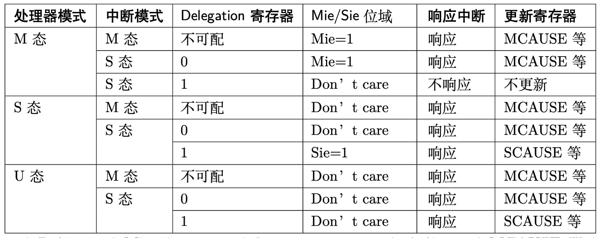

## Trap

在 ISA 语境下，trap 包括异常和中断。

在 OS 语境下，trap 包括异常、系统调用（其实也是一种异常）、中断。

- Exception

  We use the term **exception** to refer to an unusual condition occurring at run time associated with an instruction in the current RISC-V hart.

- Interrupt

  We use the term **interrupt** to refer to an external **asynchronous** event that may cause a RISC-V hart to experience an **unexpected** transfer of control.

- Trap

  We use the term **trap** to refer to the transfer of control to a trap handler caused by either an exception or an interrupt.

- Trap 处理总流程

  - 什么条件下 trap 进什么 mode
  - 进入 trap 时的 CPU 操作
  - 进入 trap 以后的软件操作
  - 退出 trap 时的 CPU 操作

- 进入和退出 trap 时的 CPU 操作

  - `mstatus` 的一部分就是 `sstatus`

    A restricted view of `mstatus` appears as the `sstatus` register in the S-level ISA.

    The `sstatus` register is a subset of the `mstatus` register.

  - 读写 `sstatus` 等于读写 `mstatus`

    In a straightforward implementation, reading or writing any field in `sstatus` is equivalent to reading or writing the homonymous field in `mstatus`.

  - 发生 trap

    When a trap is taken from privilege mode y into privilege mode x, xPIE is set to the value of xIE; xIE is set to 0; and xPP is set to y.

    从 y 进入 x，xPIE = xIE、xIE = 0、xPP = y。

    另外，xepc = pc、xcause xtavl 更新、pc = xtvec。

  - 从 trap 返回

    When executing an xRET instruction, supposing xPP holds the value y, xIE is set to xPIE; the privilege mode is changed to y; xPIE is set to 1; and xPP is set to the least-privileged supported mode (U if U-mode is implemented, else M).

    执行 xRET，xIE = xPIE，特权级 = xPP、xPIE = 1、xPP = U。

    另外，xRET 使 pc = xepc。

    MRET：MIE = MPIE，特权级 = MPP、MPIE = 1、MPP = U、pc = mepc。

    SRET：SIE = SPIE，特权级 = SPP、SPIE = 1、SPP = U、pc = sepc。

- 什么条件下 trap 进什么 mode

  下面讨论。

  如果同时出现 exception 和 interrupt，先处理谁 RISC-V 文档没有规定。老版本是有的，后来不知道为什么删了。

## Delegation

- 首先，如果不使用代理，所有 trap 都会进入 m mode 处理

  By default, all traps at any privilege level are handled in machine mode, though a machine-mode handler can redirect traps back to the appropriate level with the MRET instruction (Section 3.3.2).

- 代理就是进入 s mode 处理，但是不可能进入 u mode

  To increase performance, implementations can provide individual read/write bits within `medeleg` and `mideleg` to indicate that certain exceptions and interrupts should be processed directly by a lower privilege level.

  In systems with S-mode, the `medeleg` and `mideleg` registers must exist, and setting a bit in `medeleg` or `mideleg` will delegate the corresponding trap, when occurring in S-mode or U-mode, to the S-mode trap handler.

- 代理的用处

  - 在 S 态发生异常或中断时，可以直接在 S 态处理
  - 在 U 态发生异常或中断时，不用升到 M 态，升到 S 态就可以

- Contents of registers

  For exceptions that cannot occur in less privileged modes, the corresponding `medeleg` bits should be read-only zero. In particular, `medeleg`[11] (ecall from m-mode) is read-only zero.

  `mideleg` 实际上只有 3 位可以读写，对应 SEI STI SSI。

- 处理 trap 时特权级不会降低，只会不变或者升高

  Traps never transition from a more-privileged mode to a less-privileged mode.

  For example, if M-mode has delegated illegal instruction exceptions to S-mode, and M-mode software later executes an illegal instruction, the trap is taken in M-mode, rather than being delegated to S-mode.

  By contrast, traps may be taken horizontally. Using the same example, if M-mode has delegated illegal instruction exceptions to S-mode, and S-mode software later executes an illegal instruction, the trap is taken in S-mode.

- 什么条件下 trap 进什么 mode（异常）

  对某一个异常，如果它没被代理，不管处理器现在是 u/s/m，发生异常以后，都会进入 m-mode。

  对某一个异常，如果它被代理了，就意味着发生异常以后会进入 s-mode。

  如果处理器现在是 m，发生异常以后，代理无效，进入 m-mode。

  如果处理器现在是 s，发生异常以后，代理有效，进入 s-mode。

  如果处理器现在是 u，发生异常以后，代理有效，进入 s-mode。

  如果发生多个异常，根据异常优先级进行处理。

- 什么条件下 trap 进什么 mode（中断）

  什么条件下 trap 进什么 mode（中断）实际上分成两部分，包括中断硬件和 CPU。

  可以被代理的中断实际上只有 SEI STI SSI，下面讨论。

## 中断类型

- External interrupt

- Timer interrupt

- Software interrupt

  Software interrupts are most useful for interprocessor communication in multi-hart systems, as harts may write each other’s `MSIP` bits to effect interprocessor interrupts. (SiFive Doc)

## 中断硬件

### 基本中断硬件

市面上的 SOC 大多只实现了 PLIC 和 CLINT。

- Platform-Level Interrupt Controller (PLIC)

  https://github.com/riscv/riscv-plic-spec

  最早由 SiFive 提出并实现，现在已经被标准化。

  产生 s-mode m-mode external interrupt。

- Core-Local Interruptor (CLINT)

  https://www.sifive.com/documentation

  最早由 SiFive 提出并实现，CLINT 文档包含在 SiFive SOC 文档中。RISC-V 官方没有文档。

  产生 m-mode timer interrupt 和 m-mode software interrpt。

### 高级中断硬件

这些高级中断硬件还没有硬件实现。

- Core-Local Interrupt Controller (CLIC)

  https://github.com/riscv/riscv-fast-interrupt

  只负责 local interrupt。

- Advanced Interrupt Architecture (AIA)

  https://github.com/riscv/riscv-aia

  MSI 好像是 PCIE 引入的概念。

  – Extended Local Interrupts (AIA CSRs)
  – Incoming Message Signaled Interrupt Controller (IMSIC)
  – Advanced Platform Level Interrupt Controller (APLIC)

- Advanced Core-Local Interruptor (ACLINT)

  https://github.com/riscv/riscv-aclint

  ACLINT 兼容 CLINT。

### PLIC

- 中断仲裁（什么条件下 trap 进什么 mode）

  满足下面条件的中断源会参与中断仲裁：

  - 中断源的 IP 为 1（中断源发生电平中断或脉冲中断会将 IP 置 1）
  - 中断源的优先级 PRIO 大于 0
  - 中断源的 MIE/SIE 寄存器打开

  仲裁时先看优先级，高的优先；如果优先级一样，中断号小的优先。

  仲裁结果是中断号。

- Interrupt notification（什么条件下 trap 进什么 mode）

  Interrupt notifications generated by the PLIC appear in the meip/seip bits of the mip/sip registers for M/S modes respectively.

  当仲裁结果的优先级大于 MTH/STH 寄存器时，会向中断目标发送中断提醒，即将 mip sip 中的 MEIP SEIP 置 1。

  如果 PLIC 向同一个 hart 的不同特权级都发送中断提醒，那么 mip 的 MEIP SEIP 都会置 1。如果 SEIP 被代理，sip 中的 SEIP 也会置 1；如果 SEIP 不被代理，sip 中的 SEIP 是 0。

- 中断 claim（进入 trap 以后的软件操作）

  中断目标读 MCLAIM/SCLAIM 寄存器，读出仲裁结果的中断号。然后 PLIC 将该中断源的 IP 置 0，且在中断处理完成之前屏蔽该中断源的后续采样。

  在 claim 以后，如果存在其他中断，xEIP 位可能还会是 1。

  xEIP 位为 0 时也可以 claim。

- 中断 completion（进入 trap 以后的软件操作）

  中断目标将中断号写入 MCLAIM/SCLAIM 寄存器。（该写操作不会更新 CLAIM 寄存器。）然后 PLIC 解除中断号对应的中断源采样屏蔽，结束整个中断处理过程。

  The PLIC does not check whether the completion ID is the same as the last claim ID for that target.

### CLINT

RISC-V 文档只提到了 `mtime` 和 `mtimecmp`，关于 `msip`，只在说明 `mip.MSIP` 时说可以通过写 mmio 寄存器来更新 `mip.MSIP`，具体没说这个 mmio 寄存器是什么。

- `msip` register (memory-mapped, 1 for each hart)

  Machine-mode **software interrupts** are generated by writing to the memory-mapped control register `msip`. (SiFive Doc)

  The least significant bit of `msip` register is reflected in the `MSIP` bit of the `mip` CSR. (SiFive Doc)

- `mtimecmp` register (memory-mapped, 1 for each hart)

  A machine timer interrupt becomes pending whenever `mtime` contains a value greater than or equal to `mtimecmp`, treating the values as unsigned integers.

  The timer interrupt is reflected in the `MTIP` bit of the `mip` register. (SiFive Doc)

  Writes to `mtime` and `mtimecmp` are guaranteed to be reflected in `MTIP` eventually, but not necessarily immediately.

- `mtime` register (memory-mapped, 1 for each platform)

## CPU 的中断支持

- 单个中断进入 m-mode 的条件

  An interrupt i will trap to M-mode (causing the privilege mode to change to M-mode) if all of the following are true:

  1.  either the current privilege mode is M and the `MIE` bit in the `mstatus` register is set, or the current privilege mode has less privilege than M-mode;
  2.  bit i is set in both `mip` and `mie`;
  3.  if register `mideleg` exists, bit i is not set in `mideleg`.

- 单个中断进入 s-mode 的条件

  An interrupt i will trap to S-mode if both of the following are true:

  1.  either the current privilege mode is S and the `SIE` bit in the `sstatus` register is set, or the current privilege mode has less privilege than S-mode; and
  2.  bit i is set in both `sip` and `sie`.

- 当有中断可以 trap 进 m，也有中断可以 trap 进 s

  Interrupts to M-mode take priority over any interrupts to lower privilege modes.

  Interrupts to S-mode take priority over any interrupts to lower privilege modes.

- 多个 trap 进 m 的中断仲裁

  Multiple simultaneous interrupts destined for M-mode are handled in the following decreasing priority order: MEI, MSI, MTI, SEI, SSI, STI.

- 多个 trap 进 s 的中断仲裁

  Multiple simultaneous interrupts destined for supervisor mode are handled in the following decreasing priority order: SEI, SSI, STI.

- 什么条件下 trap 进什么 mode

  外部中断硬件在这一步中起的作用是将 mip sip 中的位进行设置。

  然后 **CPU 首先根据 mip sip 中的位判断对应的单个中断什么条件下 trap 进什么 mode**。如果存在 trap 进 m 的中断，也存在 trap 进 s 的中断，m 优先级高。然后再进行同一模式中断的仲裁，仲裁出一个中断。

### `mip`

- How to set/clear `mip` bit

  Each individual bit in register `mip` may be writable or may be read-only.

  When bit i in `mip` is writable, a pending interrupt i can be cleared by writing 0 to this bit.

  If interrupt i can become pending but bit i in `mip` is read-only, the implementation must provide some other mechanism for clearing the pending interrupt.

- `mip` bit `MEIP` read-only

  `MEIP` is read-only in `mip`, and is set and cleared by a platform-specific interrupt controller.

- `mip` bit `MTIP` read-only

  `MTIP` is read-only in `mip`, and is cleared by writing to the memory-mapped machine-mode timer compare register.

- `mip` bit `MSIP` read-only

  `MSIP` is read-only in `mip`, and is written by accesses to memory-mapped control registers.

- `mip` bit `SEIP` writable

  `SEIP` is writable in `mip`, and may be written by M-mode software to indicate to S-mode that an external interrupt is pending.

  Additionally, the platform-level interrupt controller may generate supervisor-level external interrupts.

  Supervisor-level external interrupts are made pending based on the logical-OR of the software-writable `SEIP` bit and the signal from the external interrupt controller.

  When `mip` is read with a CSR instruction, the value of the `SEIP` bit returned in the rd destination register is the logical-OR of the software-writable bit and the interrupt signal from the interrupt controller, but the signal from the interrupt controller is not used to calculate the value written to `SEIP`.

  Only the software-writable `SEIP` bit participates in the read-modify-write sequence of a CSRRS or CSRRC instruction.

- `mip` bit `STIP` writable

  `STIP` is writable in `mip`, and may be written by M-mode software to deliver timer interrupts to S-mode.

- `mip` bit `SSIP` writable

  `SSIP` is writable in `mip` and may also be set to 1 by a platform-specific interrupt controller.

### `sip`

- SEI STI SSI 只有被代理了能在 `sip` `sie` 中有效

  Restricted views of the `mip` and `mie` registers appear as the `sip` and `sie` registers for supervisor level.

  If an interrupt is delegated to S-mode by setting a bit in the `mideleg` register, it becomes visible in the `sip` register and is maskable using the `sie` register.

  Otherwise, the corresponding bits in `sip` and `sie` are read-only zero.

- 读写 sip sie 中的位就是读写 mip mie 中的位

  The `sip` and `sie` registers are subsets of the `mip` and `mie` registers. Reading any implemented field, or writing any writable field, of `sip`/`sie` effects a read or write of the homonymous field of `mip`/`mie`.

- How to set/clear `sip` bit

  Each individual bit in register `sip` may be writable or may be read-only.

  When bit i in `sip` is writable, a pending interrupt i can be cleared by writing 0 to this bit.

  If interrupt i can become pending but bit i in `sip` is read-only, the implementation must provide some other mechanism for clearing the pending interrupt (which may involve a call to the execution environment).

- `sip` bit `SEIP` read-only

  If implemented, `SEIP` is read-only in `sip`, and is set and cleared by the execution environment, typically through a platform-specific interrupt controller.

- `sip` bit `STIP` read-only

  If implemented, `STIP` is read-only in `sip`, and is set and cleared by the execution environment.

- `sip` bit `SSIP` writable

  If implemented, `SSIP` is writable in `sip` and may also be set to 1 by a platform-specific interrupt controller.

### 单个中断什么条件下 trap 进什么 mode

- 几个重要信息

  1.  中断进入 m mode 的条件
  2.  中断进入 s mode 的条件
  3.  SEI STI SSI 只有被代理了能在 `sip` `sie` 中有效

- 中断处理汇总

  

  - 处理器 u，中断 m

    m 态中断不能被代理。

    根据信息 1，如果满足下列条件，trap 进 m-mode：

    1.  此时处理器为 u，不关心 mstatus 的 MIE
    2.  mip mie 相应的位需要为 1，MEIP MTIP MSIP 都是 read-only，由 PLIC CLINT set clear
    3.  m 态中断不能被代理

  - 处理器 u，中断 s

    s 态中断可以被代理。

    如果没被代理，根据信息 1，如果满足下列条件，trap 进 m-mode：

    1.  此时处理器为 u，不关心 mstatus 的 MIE
    2.  mip mie 相应的位需要为 1，SEIP STIP SSIP 都是 writable，SEIP 也可以由 PLIC set clear
    3.  s 态中断没有被代理

    如果被代理，根据信息 1 第 3 条，不能进 m-mode。根据信息 2，如果满足下列条件，trap 进 s-mode：

    1.  此时处理器为 u，不关心 sstatus 的 SIE
    2.  根据信息 3，此时中断已经被代理，sip sie 中可以看到 mip mie 的 SEI STI SSI，只要相应的位为 1 就可以

  - 处理器 s，中断 m

    根据信息 1，如果满足下列条件，trap 进 m-mode：

    1.  此时处理器为 s，不关心 mstatus 的 MIE
    2.  mip mie 相应的位需要为 1，MEIP MTIP MSIP 都是 read-only，由 PLIC CLINT set clear
    3.  m 态中断不能被代理

  - 处理器 s，中断 s

    如果中断没被代理，根据信息 1，如果满足下列条件，trap 进 m-mode：

    1.  此时处理器为 s，不关心 mstatus 的 MIE
    2.  mip mie 相应的位需要为 1，SEIP STIP SSIP 都是 writable，SEIP 也可以由 PLIC set clear
    3.  s 态中断没有被代理

    如果中断被代理，根据信息 1 第 3 条，不能进 m-mode。根据信息 2，如果满足下列条件，trap 进 s-mode：

    1.  此时处理器为 s，需要 sstatus 的 SIE 为 1
    2.  根据信息 3，此时中断已经被代理，sip sie 中可以看到 mip mie 的 SEI STI SSI，只要相应的位为 1 就可以

  - 处理器 m，中断 m

    根据信息 1，如果满足下列条件，trap 进 m-mode：

    1.  此时处理器为 m，需要 mstatus 的 MIE 为 1
    2.  mip mie 相应的位需要为 1，MEIP MTIP MSIP 都是 read-only，由 PLIC CLINT set clear
    3.  m 态中断不能被代理

  - 处理器 m，中断 s

    如果中断没被代理，根据信息 1，如果满足下列条件，trap 进 m-mode：

    1.  此时处理器为 m，需要 mstatus 的 MIE 为 1
    2.  mip mie 相应的位需要为 1，SEIP STIP SSIP 都是 writable，SEIP 也可以由 PLIC set clear
    3.  s 态中断没有被代理

    如果中断被代理，根据信息 1 第 3 条，不能进 m-mode。根据信息 2，不满足条件 1 （处理器特权级小于等于 s），所以也不能 trap 进 s-mode。

    所以这种情况下，中断不被响应。

    RISC-V 特权级文档 medeleg mideleg 部分有举例子。
